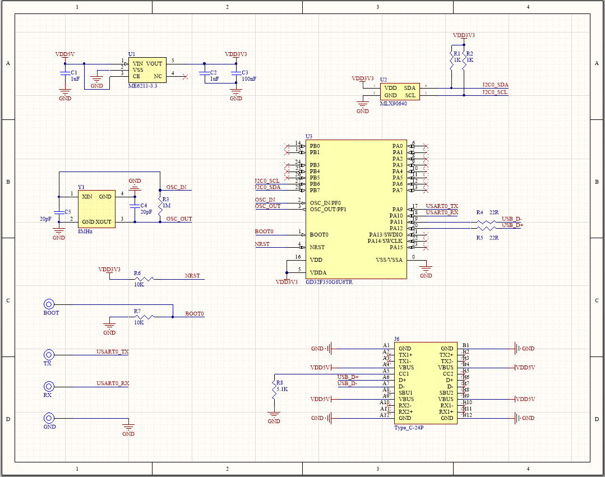
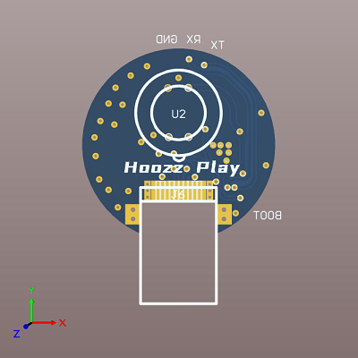
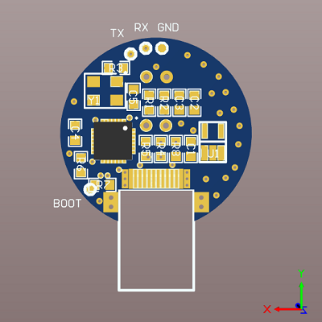
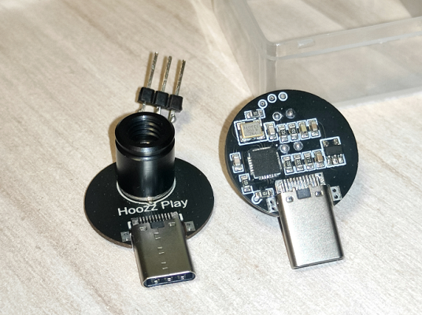

# hoozz_play_mlx90640

* MLX90640 hardware project, includes circuit diagram and MCU program

## Circuit

* Tool version: Altium Designer 18.1.9

### Sheet:

### Top view:

### Top view:

### Physical:

## MCU

* Chip: GD32F350G8U6TR
* Tool version: Keil uVision5 V5.14.0.0
* Build output: `Projects\MLX90640_USB_CDC_ACM\MDK-ARM\GD32F3x0_obj\USBD_CDC_ACM.hex`
